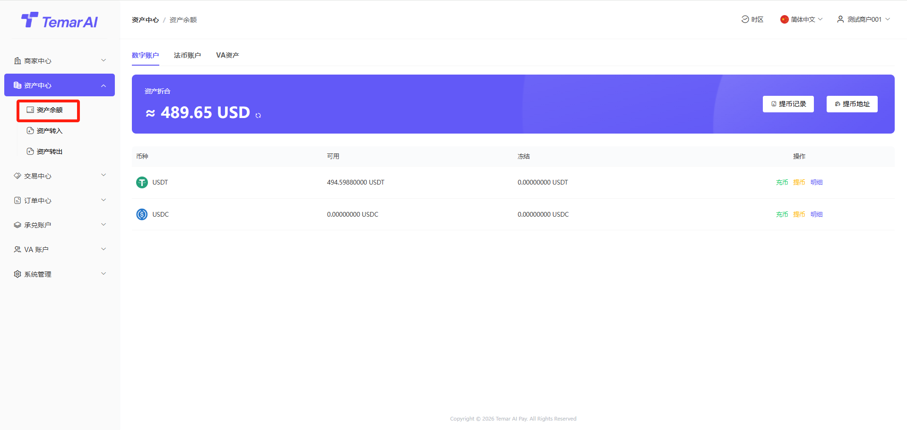
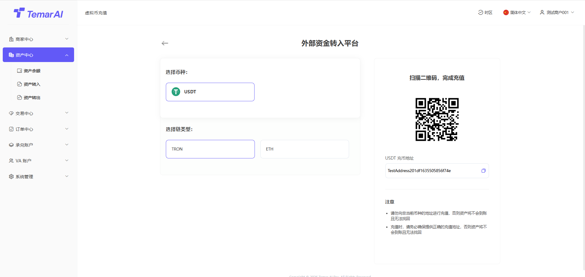
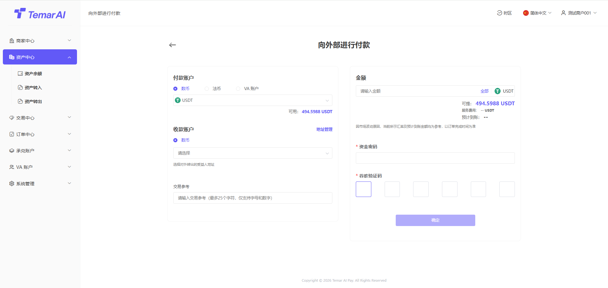
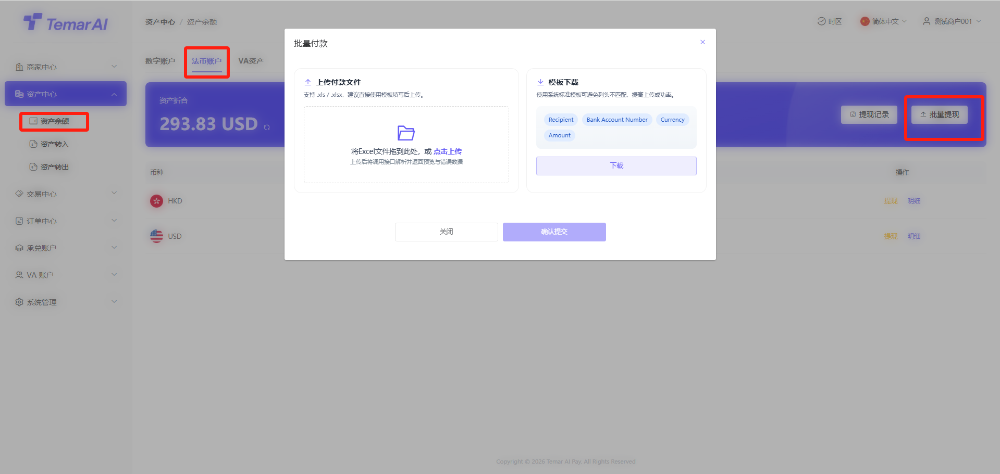
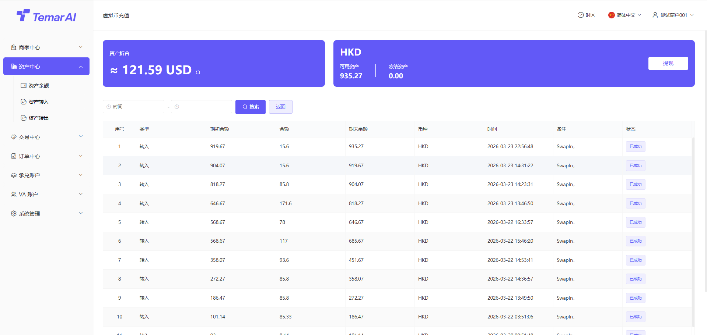
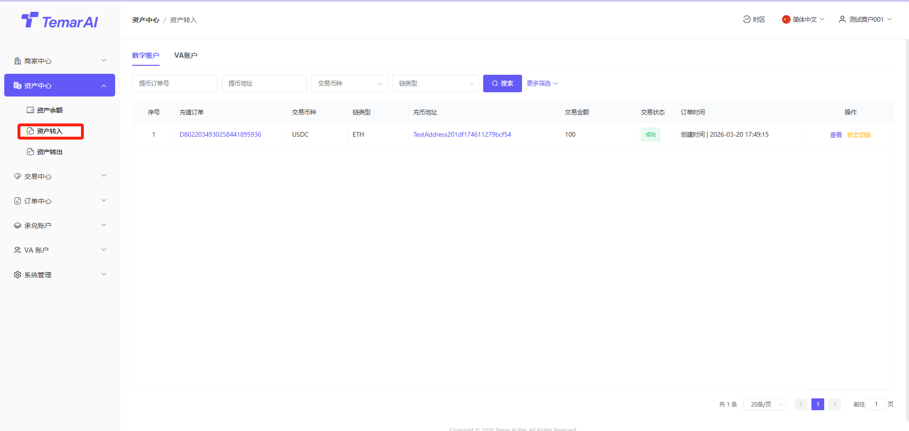
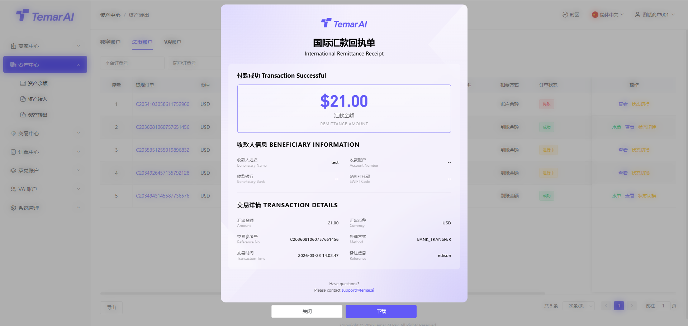

# Asset Center

The Asset Center is primarily used for managing merchant funds.

### Account Balance

Description: This page provides a centralized overview of all merchant asset balances on the platform, with entry points for fiat and digital currency deposits and withdrawals. VA accounts (under development, Coming soon!)

Operations:
- View asset overview:
- Upon entering the page, the system displays asset balances in a categorized list:
- Fiat assets: Displayed by currency (e.g., CNY, USD) showing "Available Balance", "Frozen Amount", and "Rolling Reserve".
- Digital assets: Displayed by currency (e.g., USDT, BTC) showing "Available Balance", "Frozen Amount".
- VA accounts: Coming soon
- Deposit:
- Click the "Deposit" button on the asset card for the corresponding currency.
- The system will guide you to a different deposit process based on the currency type:
- Fiat deposit: Not currently supported.
- Digital currency deposit: The system will generate a dedicated deposit address (or QR code). Transfer funds to this address to complete the deposit.

- Withdrawal:
- Click the "Withdraw" button on the asset card for the corresponding currency.
- The system will guide you to the "External Payment" page with the currency pre-selected. Fill in the withdrawal amount, select the receiving address, verify your fund password and Google Authenticator, then submit the request.

- Batch Withdrawal
- Batch withdrawal is only available for fiat account sections
- The information filled in the Excel must be from approved fiat withdrawal addresses

- Details: View the fund transaction history for a specific currency.

### Asset Inbound

Description: This page is used to query and manage all merchant digital currency deposit records, helping merchants reconcile incoming funds. Fiat / VA account deposits are not currently supported.

Operations:
- Filter: Search by order number, address, order status, time, etc.
- View: View deposit details.

### Asset Outbound

Description: This page is used to query and manage all fiat and digital currency withdrawal records.

Operations:
- View: View merchant withdrawal records for fiat and digital currencies. VA accounts Coming soon!
- Filter: Search by order number, address, order status, time, etc.
- View: View deposit details.
- Voucher: When a fiat withdrawal is completed, you can view and download the payment voucher.

