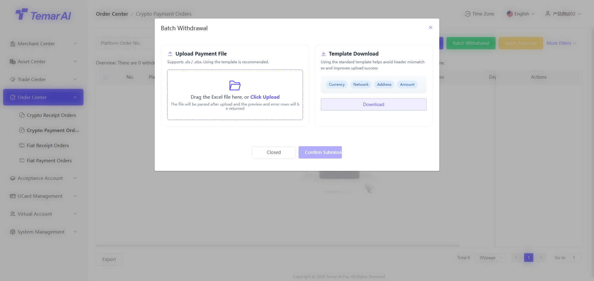
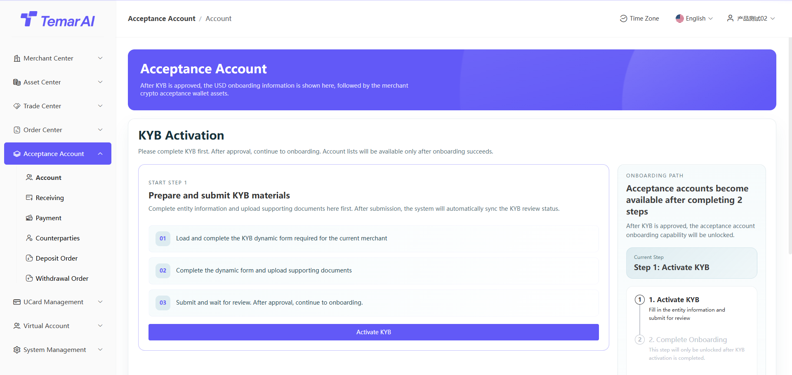
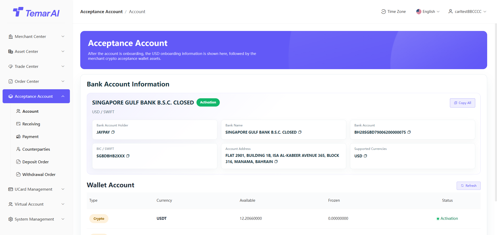
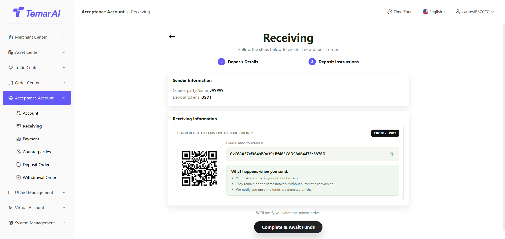
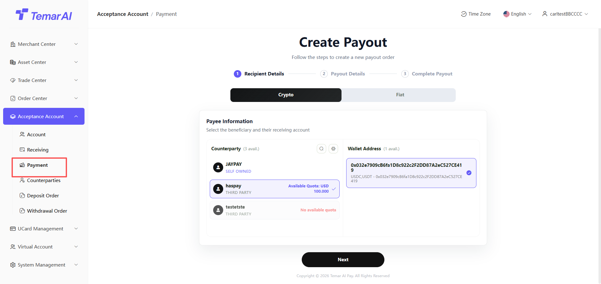
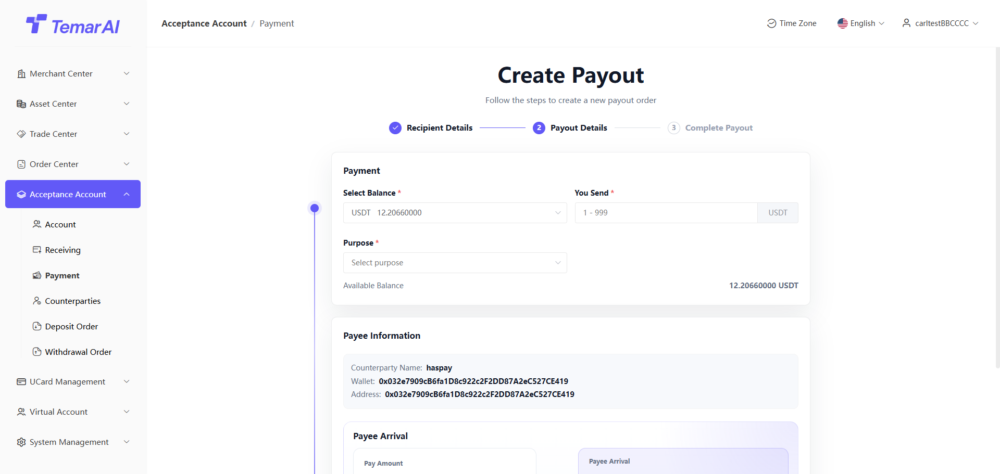
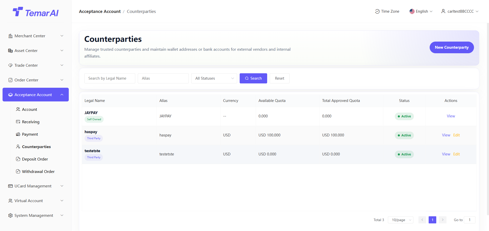
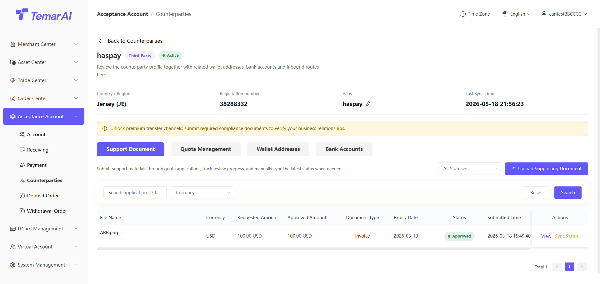
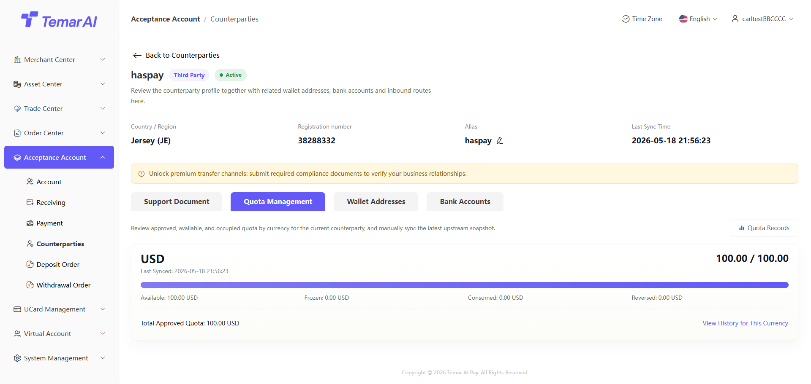

# OTC Orders

当使用OLS上游进行承兑时，有该模块，merchantKYB等information全部在OSL进行进件、每笔出入金order都在OSL进行，平台只是将data透传至上游。

account

Feature Description：This page进行承兑accountenable，以及enable承兑accountVAcollectioninformationdisplay、数币assetsdisplay。

Operations：

enable承兑account

进行KYB，填写information

填写fiat currencyaccount开卡information，进行开户Operations

view

viewfiat currencycollection银行account

viewUSDT、USDCassets情况

collection

Feature Description：merchant进行view承兑accountcollectionaccountinformation。

Operationsdescription

存款details

collection前，必须添加transaction对手以及transaction对手collection钱包address&银行卡号。

当accountcreate默认会create自有transaction对手。

存款details

数币：显示该transaction对手collection钱包address，当该钱包address收到资金，默认为该transaction对手进行transfer。

fiat currency：显示collection银行information，以及打款companyname。必须使用该transaction对手同名account进行打款，否则无法上帐。

payment

Feature Description：merchant进行承兑accountpaymentOperations。

Operationsdescription

payment对象information

payment前，必须添加transaction对手以及transaction对手collection钱包address&银行卡号。

当选择第三方transaction对手时，必须在transaction对手模块先添加paymentquota，才能进行payment。给自己payment则无需quota限制。

paymentdetails

数币：

输入paymentamount，以及用途。

payment收取cost在accountbalance中进行扣除。

displaycollection钱包addressinformation以及collectiontransaction对手，进行核实是否正确。

submitorder后，在paymentorderlistvieworderstatus。

fiat currency：

输入paymentamount，以及用途。

displaycollection钱包addressinformation以及collectiontransaction对手，进行核实是否正确。

submitorder后，在paymentorderlistvieworderstatus。

transaction对手

Feature Description：维护merchant进行出入金的对手companyinformation、出入金account、出amount度。

Operationsdescription：

transaction对手：作为出入金的对手companyinformation，出入金以transaction对手作为主体

createtransaction对手：create一个与merchant进行出入金的company主体。

edit：edit别名

主体type：

自主：merchantKYBinformationcreate的自己的主体，在create承兑account时，自行create。该主体进行出金时，无需quota限制。

第三方：其他company主体。

transaction对手-uploadfiles

upload发票、contract，待review通过后，可获得给该company打款的quota。

uploadfilesquota会进行累加。

transaction对手-quotamanagement

所有currency出amount度统一USD，merchant进行出金时，会进行扣除。

transaction对手-数币

入金

list：该transaction对手多个入金addressdisplay。打款到list钱包address中amount，均表示该transaction对手进行打款。

add：create一个新的钱包address，给merchantcollection。

出金

list：该transaction对手多个出金addressdisplay。merchant给该transaction对手打款数币时，必须是该list中review通过address。

add：create一个出金钱包address。

禁用/activate：禁用后该address打款时，无法被选择。

transaction对手-fiat currency

入金

list：该merchant多个打款银行account。该transaction对手给merchant打钱，必须走该list添加银行account打款。

add：create一个新的入金通道，必须是该transaction对手同名的银行account。

出金

list：该transaction对手多个collection银行accountdisplay。merchant给该transaction对手打款fiat currency时，必须是该list中review通过银行account。

add：create一个出金钱包address。

禁用/activate：禁用后该address打款时，无法被选择。

collectionorder

Feature Description：merchant承兑accountdepositordermanagement及view。

Operationsdescription：

添加transaction对手：当未添加transaction对手的user，给merchant银行account进行打款时，必须先entertransaction对手，添加同名transaction对手，order才能resume。

手工上账：当collectionfiat currency资金时，必须选择兑换为数字currency。confirm后，orderresume进行，最终以选择数币currency进行结算到承兑account中。

paymentorder

Feature Description：merchant承兑accountwithdrawalorderview。

