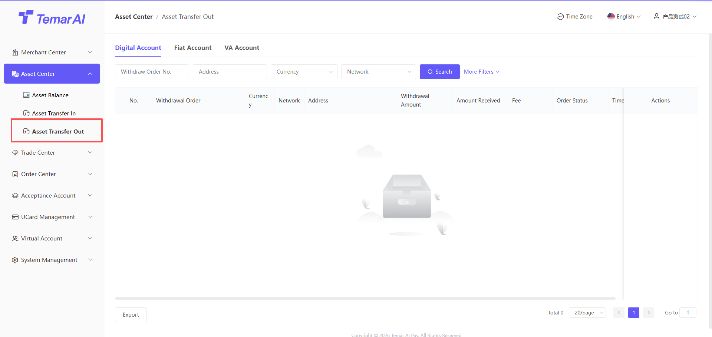
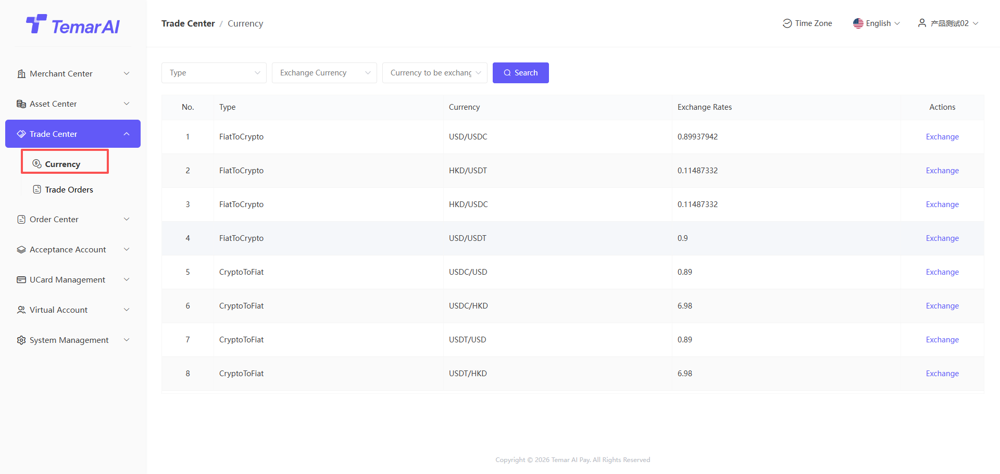

# Payout

payment是merchantmanagement所有向userpayment（代付）order、跟踪资金status的核心功能模块。

数币paymentorder

Feature Description：This page集中display您数字currency代付orderrecords，便于查询、跟踪和management。

Operations：

filter：order号、type、transactionstatus、timesearch。

view：orderwithdrawal详细字段。

orderstatus：平台submit后，在链上confirmsuccess后，order变为complete中。

回调notifications：回调success后，表示已notifications下游interface。

免审settings：可settingscurrency需要在merchant后台进行review，如不settings则均是免审。

list：显示settingscurrency免审data。

免审quantity：高于该数字的withdrawalorder均需要merchant进行手工review。

currency：需要reviewcurrency

链type：currency归属公链

status：开启、close

批量payment：downloadtemplates进行填写批量paymentcollectioninformation

review/批量review：review通过后，代付order进行上链payment。review不通过orderfailed。

切换status：该Operations仅沙河environment存在，用于API对接时，调试使用。

fiat currencypaymentorder

尽情期待！
