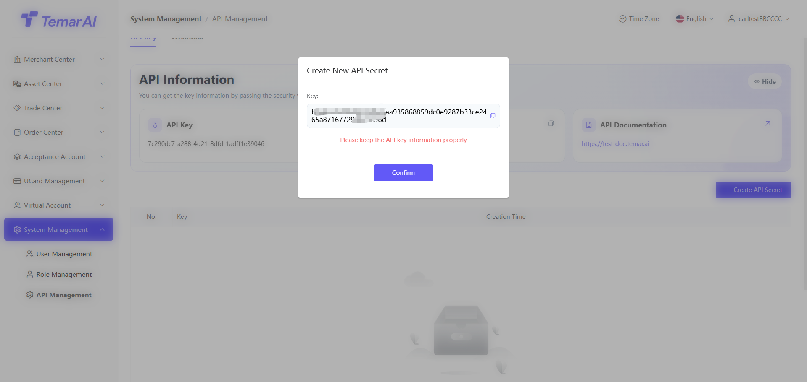
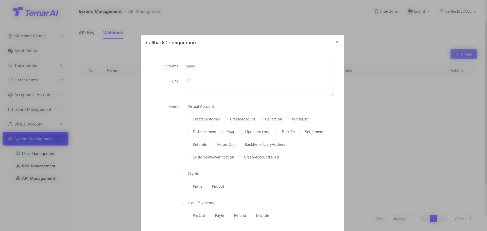
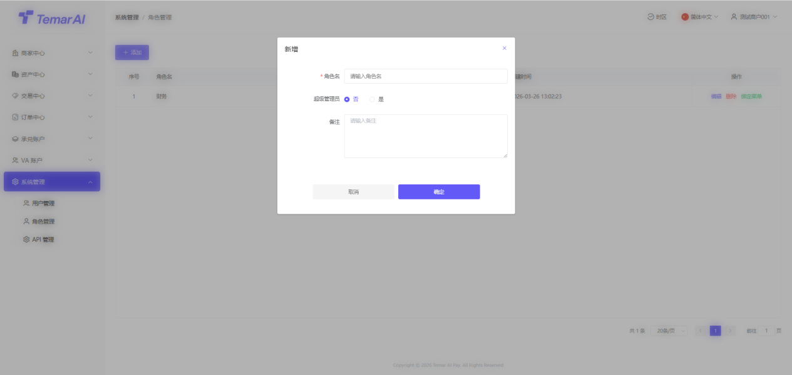
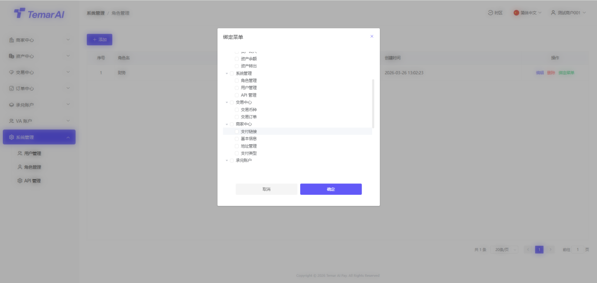
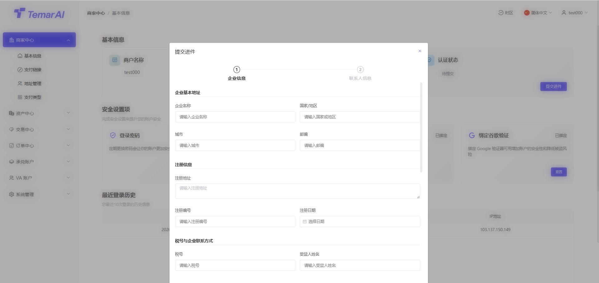
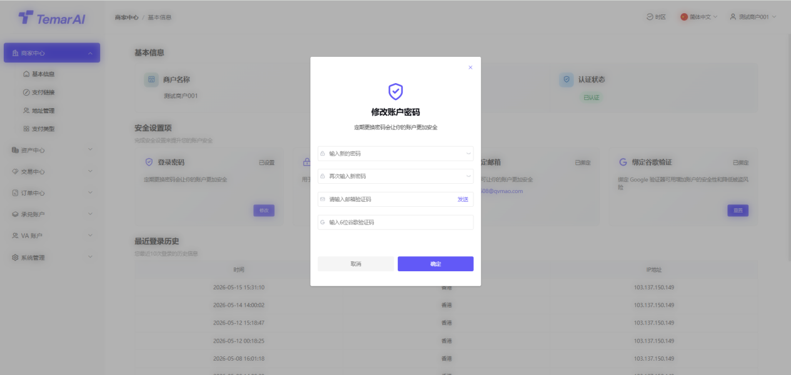
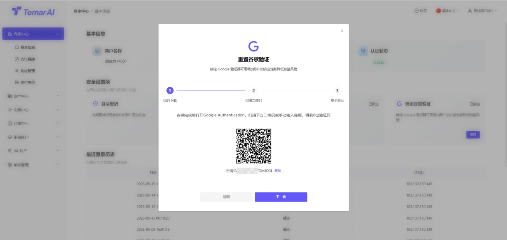
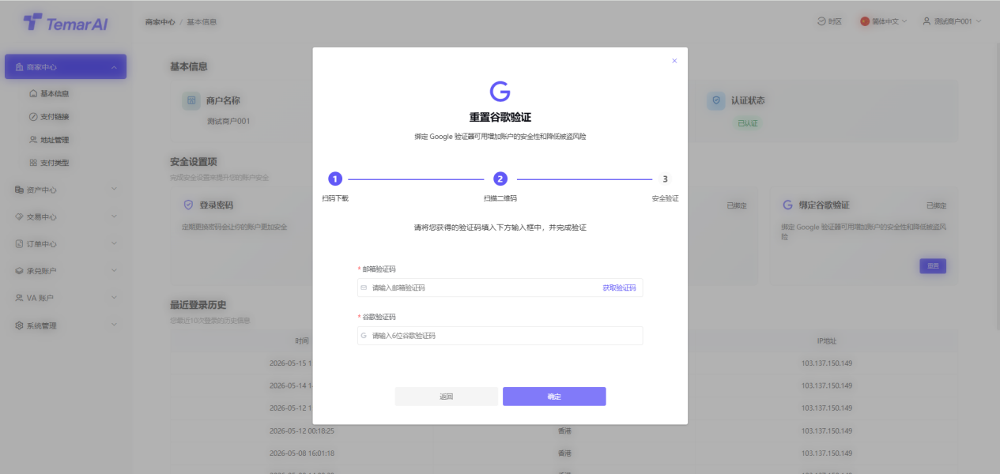
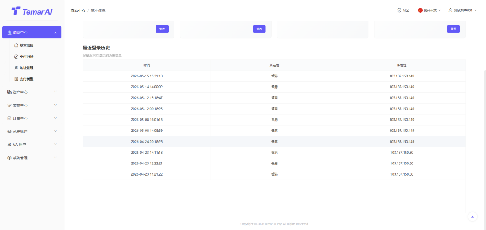

# System Admin

systemmanagement板块是平台management员进行全局configuration、managementuser与permissions、APImanagement、monitoringsystemrun的后台中枢。

usermanagement

Feature Description：view平台所有后台management员accountinformation，并进行accountstatusmanagement。

Operations：

filter：account名、status、time进行search

add：

account名：login需要使用user名建议和邮箱一致

user名：仅用于显示该username

邮箱：用于敏感Operations时，securityverify，会需要收verify码

status：禁用后，将无法loginmerchant后台

password：loginpasswordsettings

confirmpassword：重复输入loginpassword

谷歌verify码：verify当前loginaccount谷歌verify码，用于securityverify

edit：edituser名以及status

delete：deleteuser后，user无法loginmerchant后台

分配roles：分配roles后，该user拥有该roles对应permissions

·

rolesmanagement

Feature Description：view平台所有后台rolesinformation，并进行rolespermissionsmanagement。

Operations：

add：createroles名，用于该rolespermissions。例如：财务、运营等

超级management员:默认选否即可

edit：edit已createrolesinformation

delete：deleteroles后，绑定该roles的user将无任何permissions

绑定菜单：roles绑定菜单，对应绑定rolesuser才能entermanagement及view该菜单

security中心

该page主要managementloginmerchant的基础securityinformation以及最佳login历史view。

资料reviewmanagement

Feature Description：submit资料平台review，当未submit资料时，permissions较少。

Operations步骤：

click“verification”

填写企业information

填写contact人information

submitreview

review通过后，获得更多permissions

loginpasswordmanagement

Feature Description：modifyloginmerchant后台的password。

Operations步骤：

click“modifyloginpassword”。

settings新loginpassword（输入长度为8-18，数字字母大小写符号组合的password）。

再次输入新passwordconfirm。

输入邮件verify码/谷歌verify码进行身份verify。

click“确定”，passwordmodify即时生效。

资金passwordmanagement

Feature Description：settings或modify用于withdrawal等资金Operations时的二次verifypassword。

Operations步骤：

click“modify资金password”。

settings新资金password（输入长度为8-18，数字字母大小写符号组合的password）。

再次输入新passwordconfirm。

输入邮件verify码/谷歌verify码进行身份verify。

click“确定”，passwordmodify即时生效。

谷歌verify器绑定

Feature Description：绑定谷歌verify器（Google Authenticator），为login或关键Operations增加动态口令（MFA）protection。默认首次login必须绑定。

如忘记原谷歌verify码，请contact平台进行重置。

Operations步骤：

click“重置谷歌verify器”。

使用谷歌verify器APP扫描page上显示的QR code。

APP将生成一个6位动态verify码。

在page输入框内填写该verify码。

click“next”，进行securityverify。

输入邮件verify码/原谷歌verify码进行身份verify。

confirmsuccess后，重置谷歌success。

最近login历史

Feature Description：显示该merchantaccount最佳loginregion及IPinformation，如发现在未知regionlogin，请及时modifypassword以及谷歌verify器。

