# Merchant Portal

### Basic Information

This page primarily manages the basic security information of the logged-in merchant and provides login history viewing.

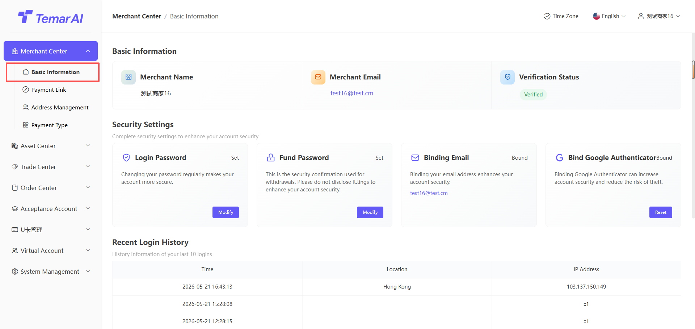

Document Review Management

* Description: Submit documents for platform review. When documents have not been submitted, permissions are limited.
* Steps:
* Click "Verification"
* Fill in company information
* Fill in contact information
* Submit for review
* After approval, more permissions are granted

Login Password Management

* Description: Change the password used to log in to the merchant backend.
* Steps:
* Click "Change Login Password".
* Set a new login password (8-18 characters, combination of numbers, uppercase and lowercase letters, and symbols).
* Re-enter the new password to confirm.
* Enter the email verification code / Google verification code for identity verification.
* Click "Confirm", and the password change takes effect immediately.

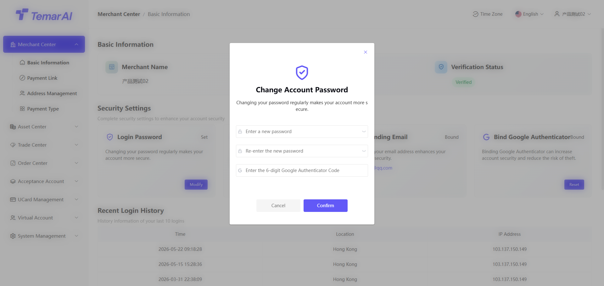

Fund Password Management

* Description: Set or change the secondary verification password used for fund operations such as withdrawals.
* Steps:
* Click "Change Fund Password".
* Set a new fund password (8-18 characters, combination of numbers, uppercase and lowercase letters, and symbols).
* Re-enter the new password to confirm.
* Enter the email verification code / Google verification code for identity verification.
* Click "Confirm", and the password change takes effect immediately.

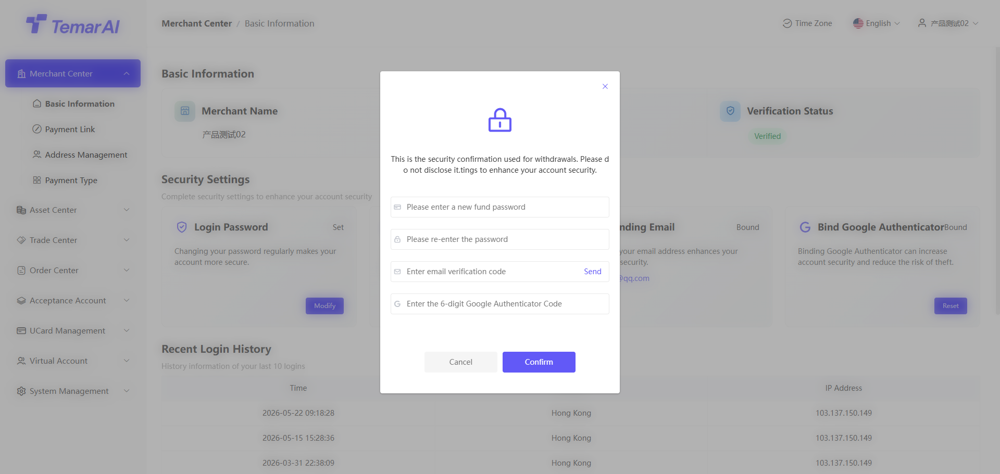

Google Authenticator Binding

* Description: Bind Google Authenticator to add dynamic token (MFA) protection for login or critical operations. Binding is required by default on first login.
* If you forget the original Google verification code, please contact the platform for a reset.
* Steps:
* Click "Reset Google Authenticator".
* Use the Google Authenticator app to scan the QR code displayed on the page.
* The app will generate a 6-digit dynamic verification code.
* Enter the code in the input field on the page.
* Click "Next" to proceed with security verification.
* Enter the email verification code / original Google verification code for identity verification.
* After successful confirmation, the Google Authenticator reset is complete.

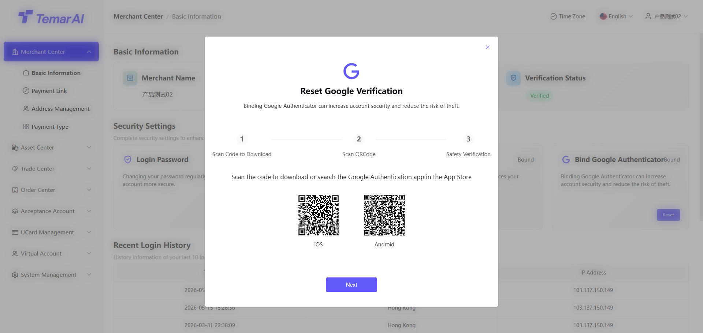

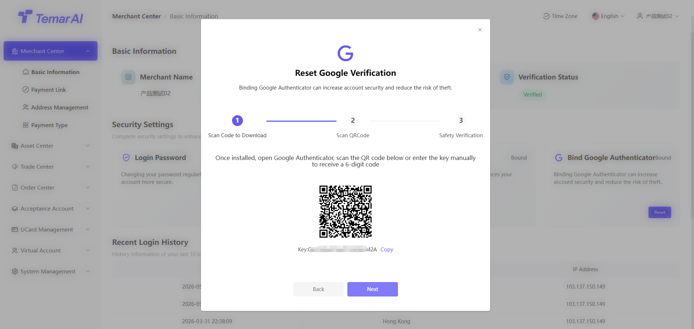

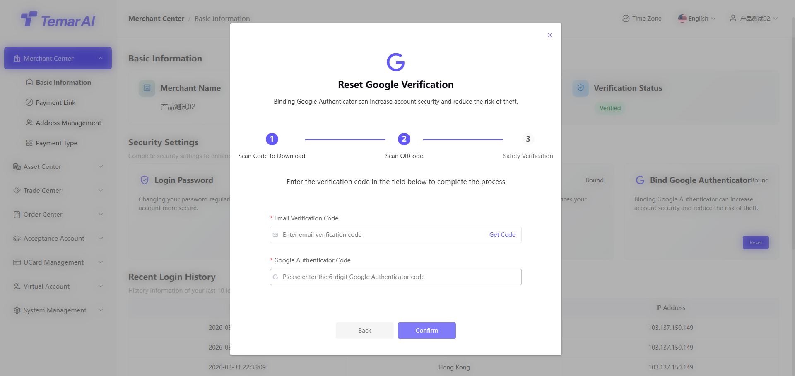

Recent Login History Description: Displays the most recent login region and IP information for this merchant account. If you detect logins from unknown regions, please change your password and Google Authenticator immediately.

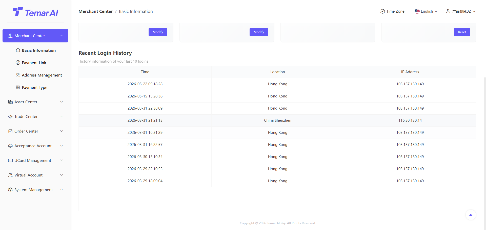

### Payment Links

Link List

* Description: This module displays all created collection links.

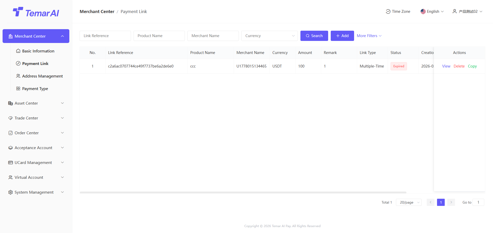

* Operations:
* Filter: Search by identifier, product name, time, and other conditions.
* View: View detailed information of a specific payment link and its corresponding orders.

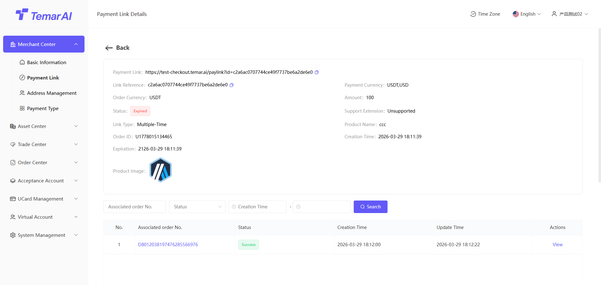

* Delete: Once deleted, the payment link becomes invalid.
* Copy: Click the "Copy Link" button to share the URL with buyers for payment.
* Create: Generate a fixed collection link for buyers with flexible parameter configuration, including:
* Link basic information: Product name, product description: Will be displayed on the payment checkout page Image: If not set, the merchant logo will be displayed Advanced settings: If configured, users will need to fill in the corresponding information on the payment checkout page Pricing currency: The currency used for price calculation for this payment link Pricing amount: The amount the user needs to pay. If left blank, the user will fill it in on the checkout page
* Link configuration: Type: Select crypto or fiat (single choice). Determines the available payment methods for actual payment Currency/Amount: Based on the selected type, choose the specific currency and order amount Link type: One-time / Reusable, determining whether the link can initiate one or multiple transactions Link validity period: Currently supports 4 options: 24h / 48h / Permanent, Custom (within a 6-month range)

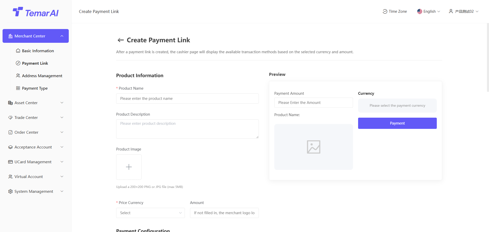

### Address Management

Description: This module is used by merchants to manage their receiving addresses for fiat and digital asset withdrawals. Addresses submitted by merchants must be approved by the platform before they can be used.

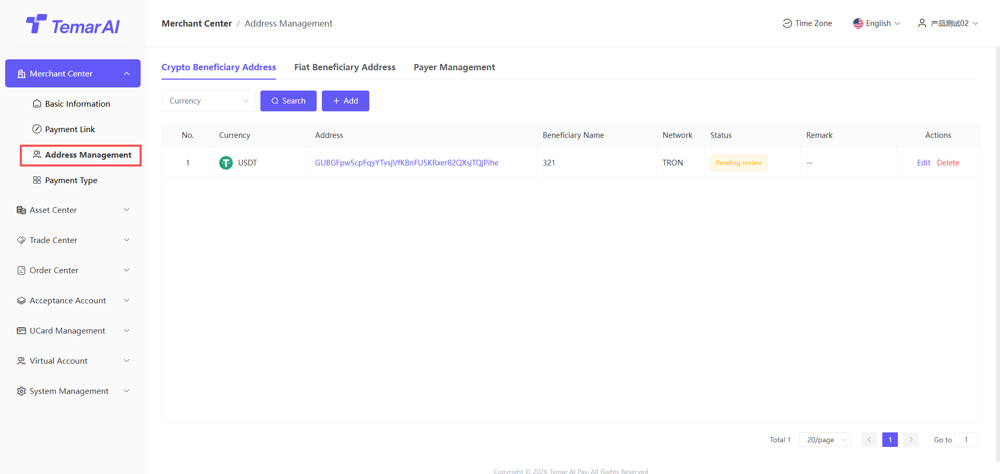

Digital Asset Address Operations:

* Filter: Search by currency.
* Edit: Modify receiving address information.
* Add:
* Beneficiary name: Receiving address name
* Currency: Currency name
* Chain type: The public chain the currency belongs to
* Currency address: Receiving wallet address

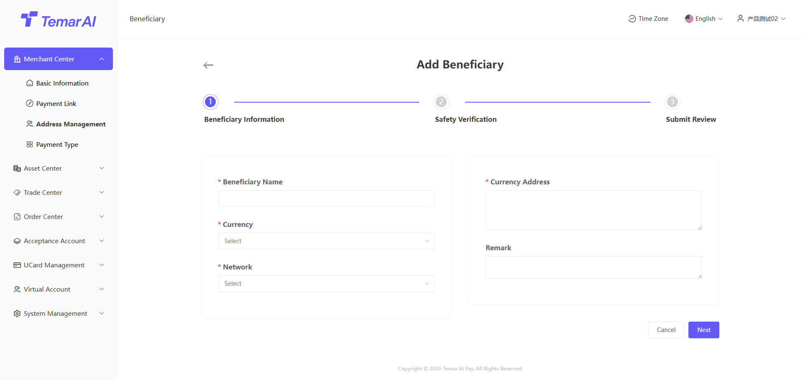

Fiat Asset Address Operations:

* Filter: Search by currency.
* View: View added fiat receiving address information.

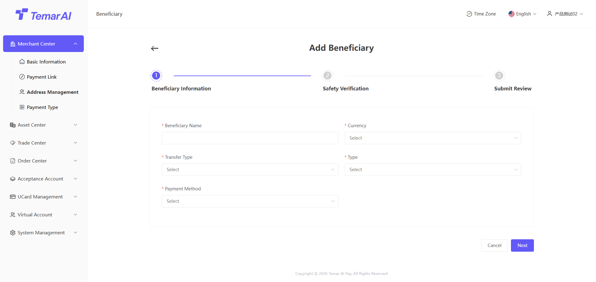

### Payment Types

Description: This module allows merchants to view the collection/payment currencies they have enabled, along with corresponding fees and settlement rules. To add new currencies, please contact the platform.

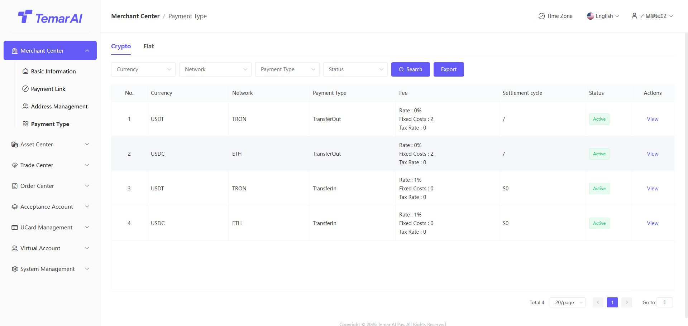

Operations:

* Filter: Search by currency, payment type, status, etc.
* View: View detailed information for a specific currency.
