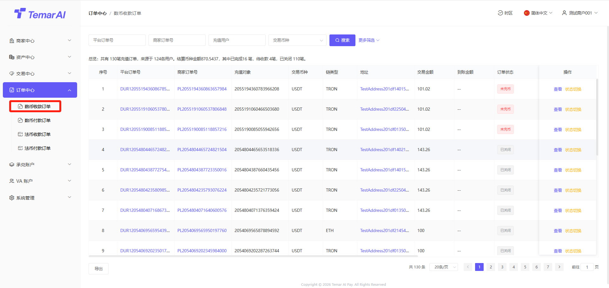
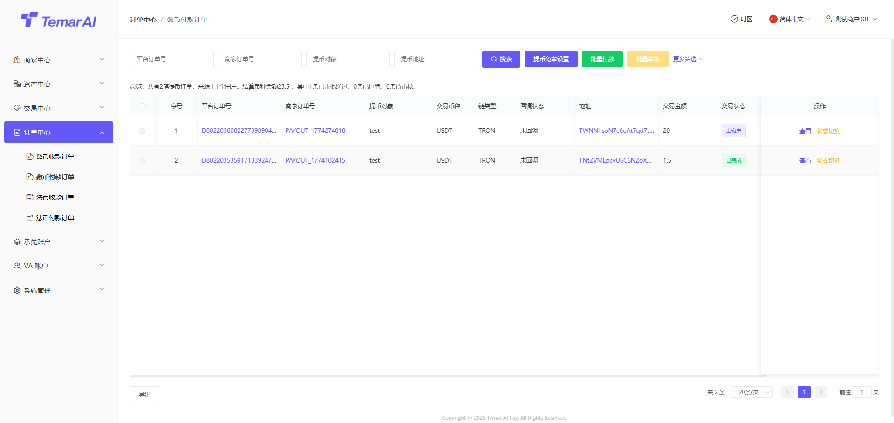
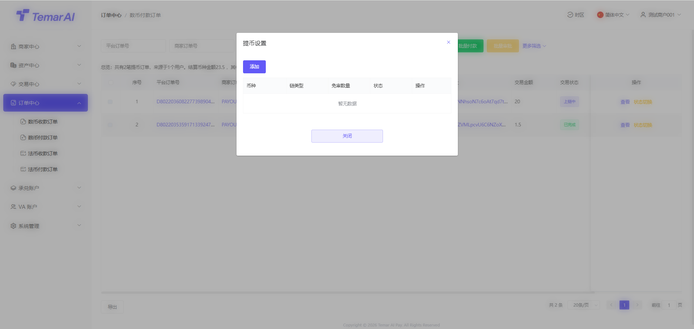
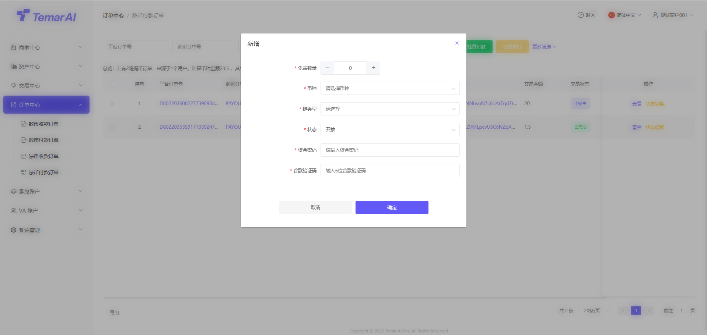

# Order Center

The Order Center is the core module for merchants to manage all collection (inbound) and payment (outbound) orders and track fund statuses.

### Crypto Collection Orders

Description: This page provides a centralized view of your digital currency collection order records for querying, tracking, and management. Includes orders placed via API and payment links.

Operations:
- Filter: Search by order number, type, transaction status, time.
- View: View detailed fields of the deposit order.
- Order status: Funds are credited to the merchant's frozen assets only after the order succeeds.
- Settlement status: Funds are credited to the merchant's available assets only when settlement becomes successful.
- Callback notification: A successful callback indicates the downstream interface has been notified.
- Toggle status: This operation exists only in the sandbox environment, used for debugging during API integration.

### Crypto Payment Orders

Description: This page provides a centralized view of your digital currency payment order records for querying, tracking, and management.

Operations:
- Filter: Search by order number, type, transaction status, time.
- View: View detailed fields of the withdrawal order.
- Order status: After the platform submits, the order is marked as completed once confirmed on-chain.
- Callback notification: A successful callback indicates the downstream interface has been notified.
- Auto-approval settings: Configure currencies that require manual review in the merchant backend. If not set, all orders are auto-approved.
- List: Displays auto-approval settings by currency.
- Auto-approval threshold: Withdrawal orders above this amount require manual review by the merchant.
- Currency: The currency requiring review
- Chain type: The public chain the currency belongs to
- Status: Enabled / Disabled

- Batch payment: Download the template to fill in batch payment recipient information

- Approve / Batch approve: Approved payment orders are submitted on-chain. Rejected orders are marked as failed.
- Toggle status: This operation exists only in the sandbox environment, used for debugging during API integration.

### Fiat Collection Orders

Coming soon!

### Fiat Payment Orders

Coming soon!
