# OTC Orders

This module appears when using an OSL upstream for OTC services. All merchant KYB and other information is processed through OSL, and every deposit/withdrawal order goes through OSL. The platform only passes data through to the upstream.

### Account

Description: This page is for opening an OTC account, displaying VA receiving information and digital currency assets for the OTC account.

Operations:
- Open an OTC account
- Complete KYB, fill in required information
- Fill in fiat account card opening information, proceed with account opening
- View
- View fiat receiving bank account
- View USDT, USDC asset status

### Collection

Description: Merchants can view the OTC account receiving account information.

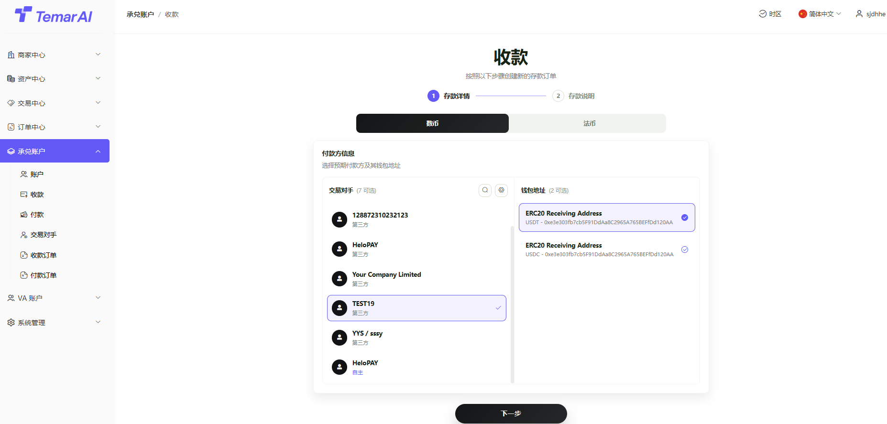

Operation Details
- Deposit details
- Before receiving funds, you must add a counterparty and the counterparty's receiving wallet address & bank account number.
- When an account is created, a self-owned counterparty is created by default.
- Deposit details
- Digital currency: Displays the counterparty's receiving wallet address. When funds are received at this address, they are automatically attributed to that counterparty for transfer.

- Fiat: Displays receiving bank information and the remitting company name. The remittance must be made from a bank account under the same name as the counterparty, otherwise it cannot be credited.

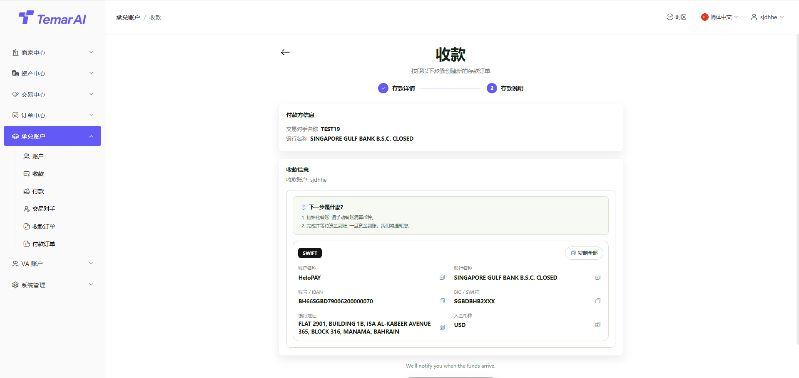

### Payment

Description: Merchants perform payment operations from the OTC account.

Operation Details
- Payee information
- Before making a payment, you must add a counterparty and the counterparty's receiving wallet address & bank account number.
- When selecting a third-party counterparty, you must first add a payment quota in the counterparty module before making a payment. Payments to yourself have no quota restrictions.

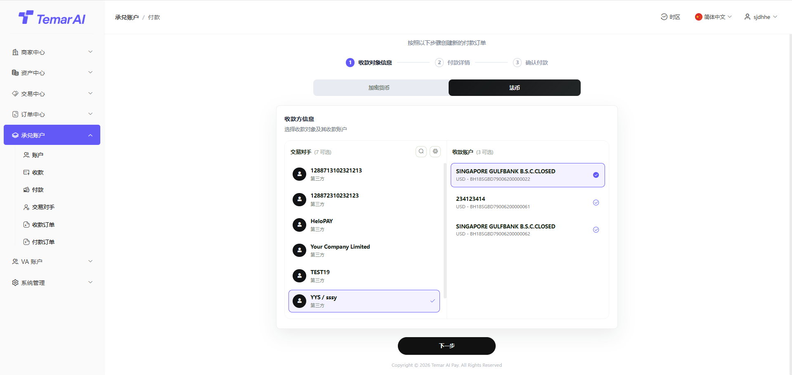

- Payment details
- Digital currency:
- Enter the payment amount and purpose.
- Payment fees are deducted from the account balance.
- Display the receiving wallet address information and receiving counterparty for verification.
- After submitting the order, check the order status in the payment order list.

- Fiat:
- Enter the payment amount and purpose.
- Display the receiving wallet address information and receiving counterparty for verification.
- After submitting the order, check the order status in the payment order list.

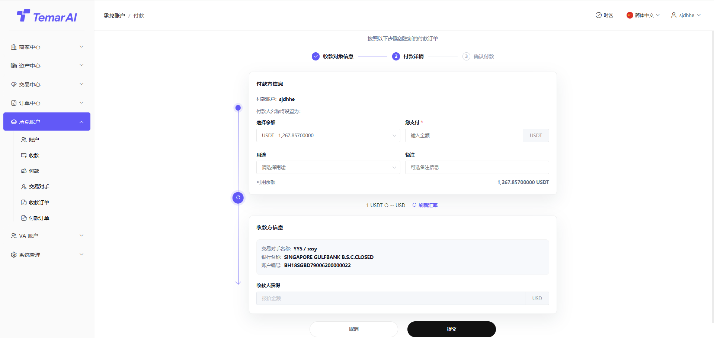

### Counterparty

Description: Maintain counterparty company information, deposit/withdrawal accounts, and withdrawal quotas for the merchant.

Operation Details:
- Counterparty: The counterparty company information for deposits and withdrawals. All deposits and withdrawals are based on the counterparty as the entity.
- Create counterparty: Create a company entity that conducts deposits and withdrawals with the merchant.

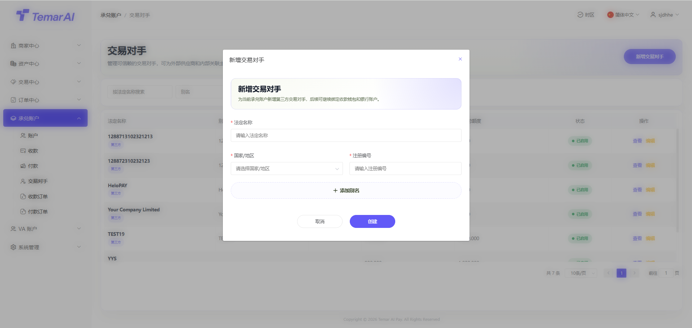

- Edit: Edit the alias
- Entity type:
- Self-owned: The merchant's own entity created from KYB information, automatically created when opening an OTC account. No quota restrictions for withdrawals from this entity.
- Third-party: Other company entities.
- Counterparty - Upload Documents
- Upload invoices or contracts. After approval, you will receive a payment quota for that company.
- Uploaded document quotas are cumulative.

- Counterparty - Quota Management
- All currency withdrawal quotas are unified in USD. Quotas are deducted when the merchant makes a withdrawal.

- Counterparty - Digital Currency
- Inbound
- List: Displays multiple inbound addresses for the counterparty. Funds sent to any listed wallet address are attributed to that counterparty.
- Add: Create a new wallet address for receiving merchant funds.

- Outbound
- List: Displays multiple outbound addresses for the counterparty. When the merchant sends digital currency to the counterparty, it must be to an approved address in this list.
- Add: Create an outbound wallet address.
- Disable / Enable: When disabled, this address cannot be selected for payments.

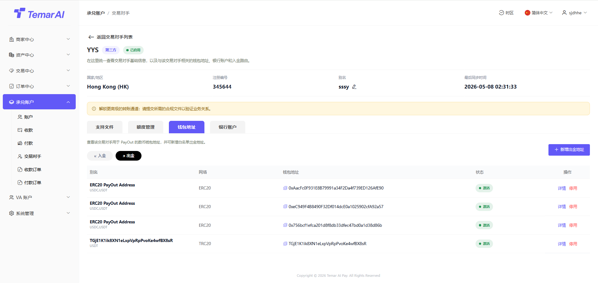

- Counterparty - Fiat
- Inbound
- List: Displays multiple remitting bank accounts for the merchant. When the counterparty sends funds to the merchant, they must use a bank account added in this list.
- Add: Create a new inbound channel. The bank account must be under the same name as the counterparty.

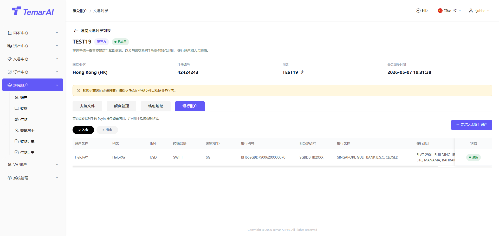

- Outbound
- List: Displays multiple receiving bank accounts for the counterparty. When the merchant sends fiat to the counterparty, it must be to an approved bank account in this list.
- Add: Create an outbound wallet address.
- Disable / Enable: When disabled, this address cannot be selected for payments.

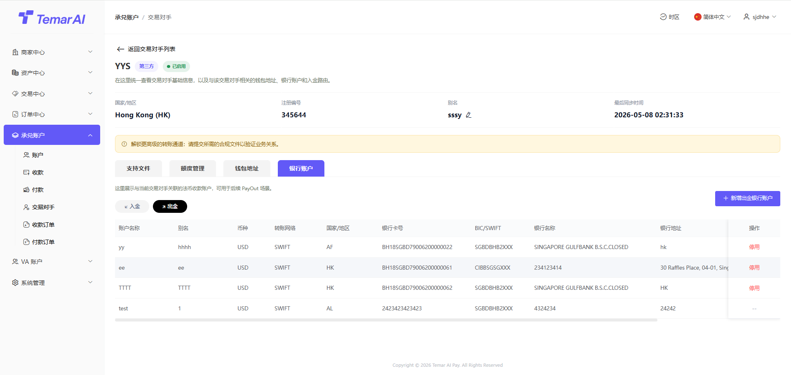

### Collection Orders

Description: Merchant OTC account deposit order management and viewing.

Operation Details:
- Add counterparty: When a user who has not added a counterparty sends funds to the merchant's bank account, they must first go to the counterparty module and add a same-name counterparty for the order to proceed.

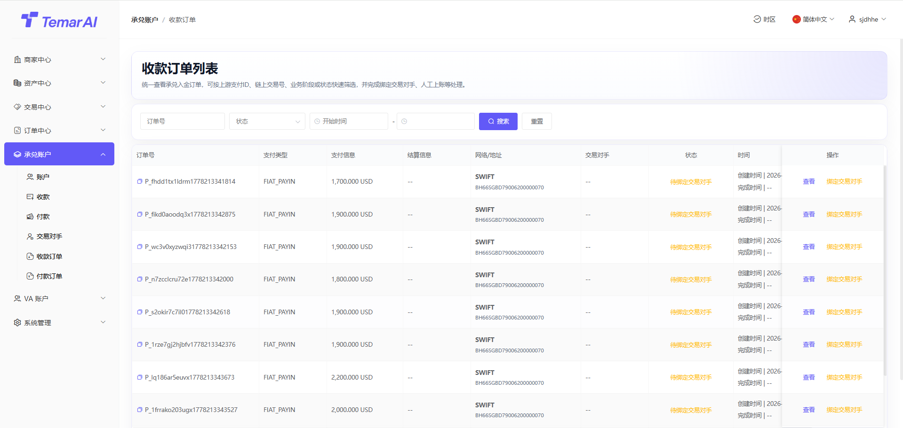

- Manual crediting: When receiving fiat funds, you must select conversion to a digital currency. After confirmation, the order continues and is ultimately settled in the selected digital currency to the OTC account.

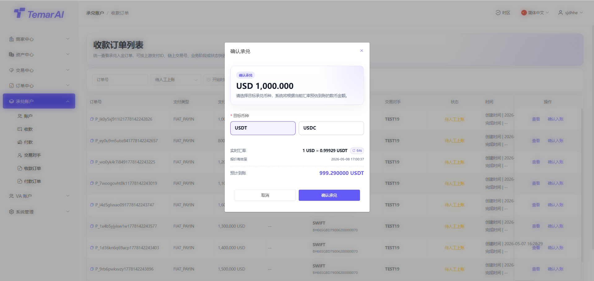

### Payment Orders

Description: View merchant OTC account withdrawal orders.

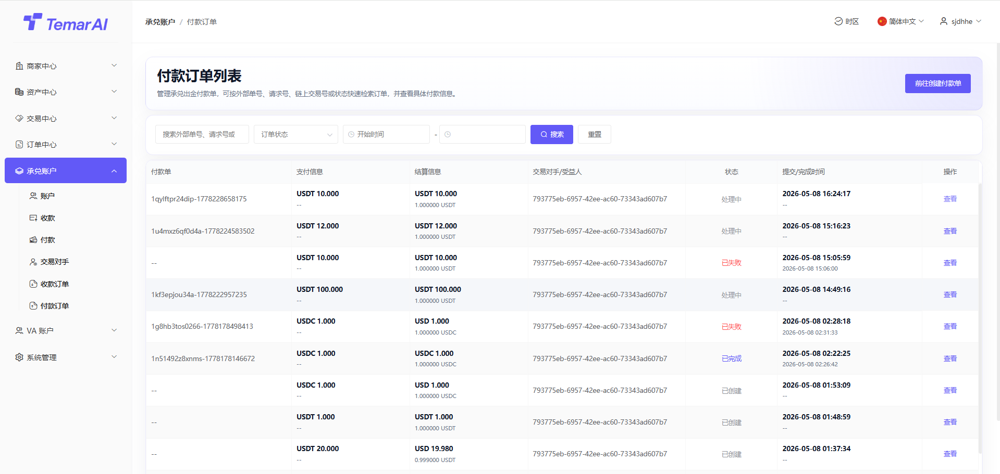
