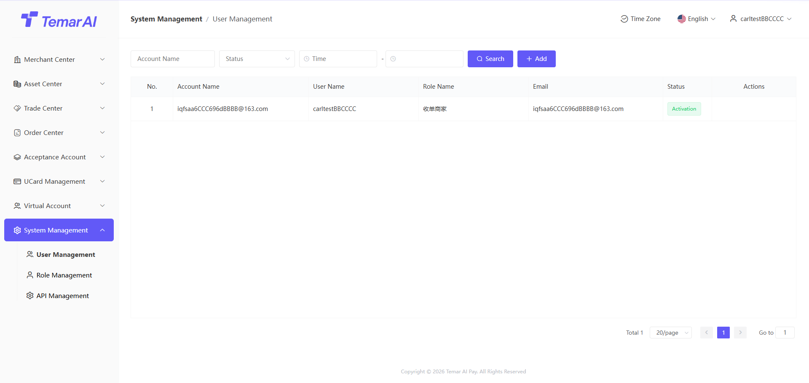
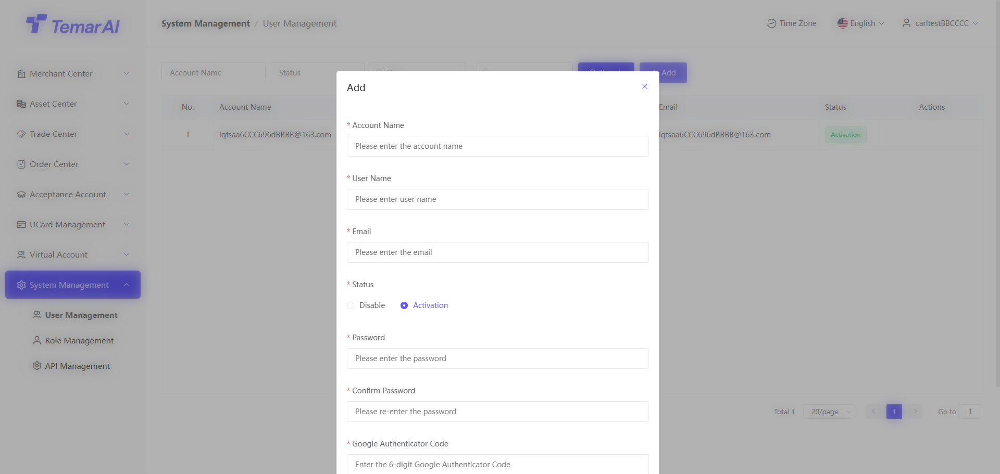
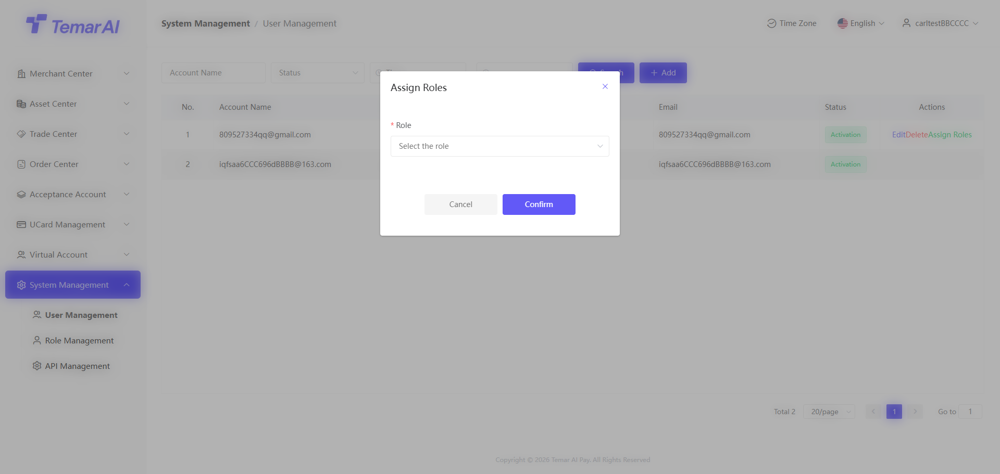
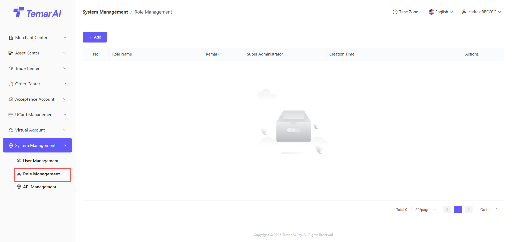
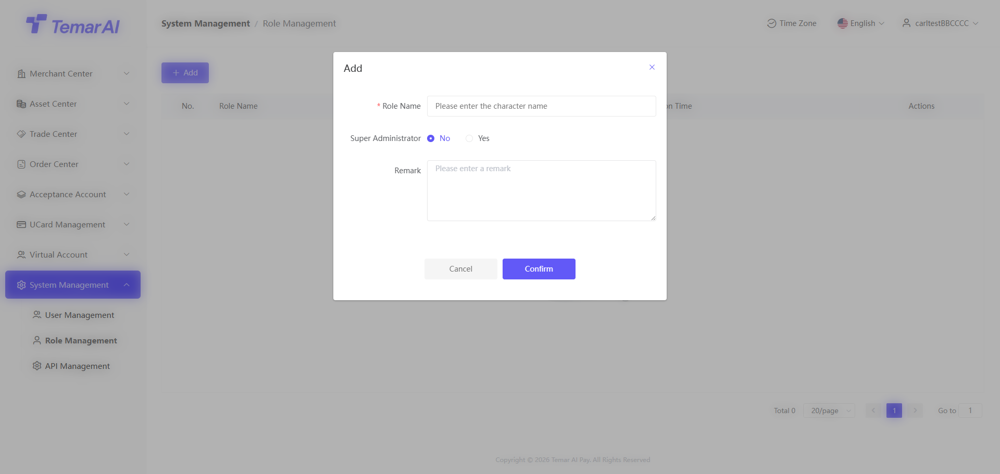
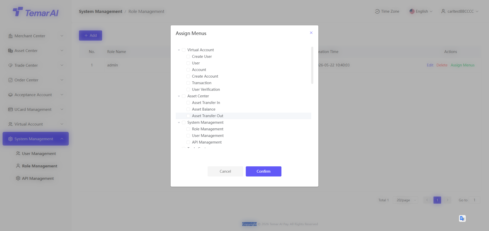
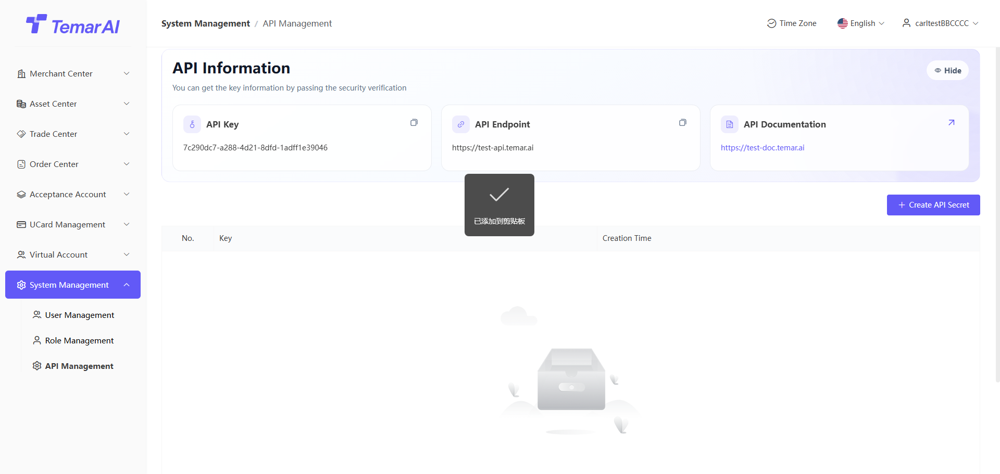

# System Admin

The System Admin module is the backend hub for platform administrators to perform global configuration, manage users and permissions, manage APIs, and monitor system operations.

### User Management

Description: View all backend administrator account information on the platform and manage account status.

Operations:

* Filter: Search by account name, status, time
* Add:
* Account name: The username required for login; it is recommended to use the same as the email
* Display name: Used only to display the user's name
* Email: Used for security verification during sensitive operations; verification codes will be sent here
* Status: When disabled, the user cannot log in to the merchant backend
* Password: Set the login password
* Confirm password: Re-enter the login password
* Google verification code: Verify the Google verification code of the currently logged-in account for security verification

* Edit: Edit display name and status

* Delete: After deletion, the user cannot log in to the merchant backend
* Assign role: After assigning a role, the user inherits the permissions of that role

### Role Management

Description: View all backend role information on the platform and manage role permissions.

Operations:

* Add: Create a role name for the role's permissions. For example: Finance, Operations, etc.
* Super admin: Default to "No"

* Edit: Edit created role information
* Delete: After deleting a role, users bound to that role will lose all permissions
* Bind menu: Bind menus to a role; only users with the bound role can access and view those menus

### API Management

Description: Manage all merchants/applications that have been created and have applied for API permissions.

Operations:

* Create API Secret: Create an API key and provide it to the technical team for integration. Please keep this key secure. If there is a risk of leakage, replace it immediately.

* Webhooks: Technical parameter configuration. Select corresponding events based on business needs.

