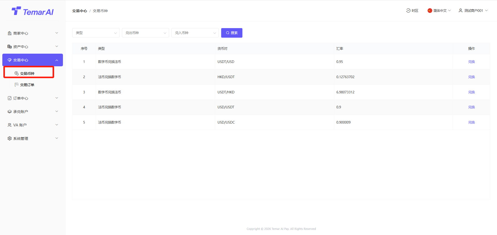
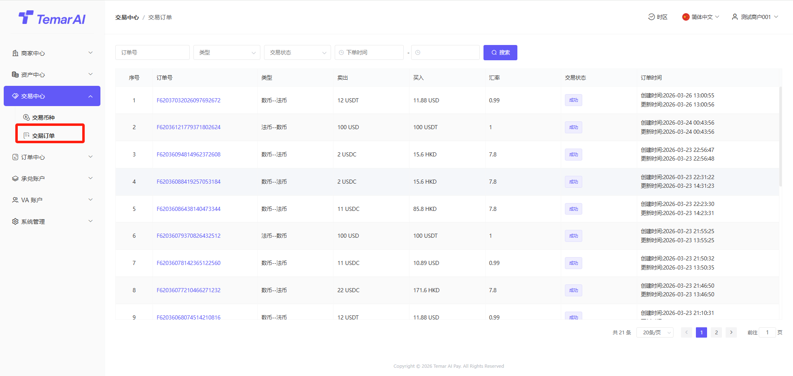

# Trading Center (Platform Hedging Version)

The Trading Center module is a collection of features for merchants to perform currency exchange between fiat and digital currency accounts, view exchange rate quotes, and manage all exchange orders.

Trading Pairs
Description: This page displays all currency exchange trading pairs supported by the platform, provides real-time exchange rate information, and allows merchants to perform currency exchange operations.

Operations:
- Filter: Search by type, currency.
- Exchange:
Select transaction type: Buy [target currency] or Sell [base currency].
Enter the amount of the currency you wish to spend in the "Amount" field. The system will automatically calculate the amount you will receive in the "Receive" field based on the real-time exchange rate.
Confirm the displayed exchange rate, estimated fee, and estimated amount to be received.
Enter your fund password and Google verification code, then click "Confirm" to submit the order.

Trading Orders
Description: This page provides a centralized view of all your currency exchange order records for querying, tracking, and management.

Operations:
- Filter: Search by order number, type, transaction status, time.

